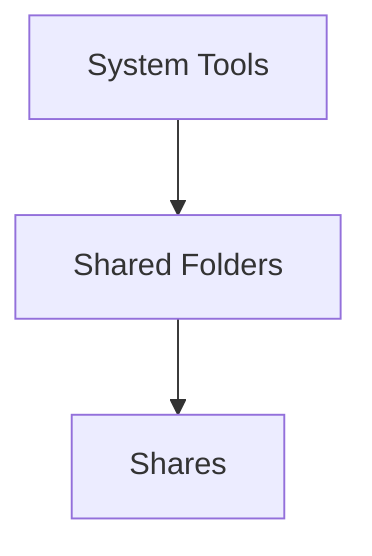

>[!attention] 
Care should be taken to ensure that only the required users have the correct permissions on the folder/s in question

The following are the steps to create a new file share, in this example i will use myself (lcorcoran) as the user. With the folder being called *Obsidian* located on *misreporting*
## Enabling the share

1. Open a remote desktop connection (RDC) to the server where the folder is located
2. Locate the folder in File Explorer 
3. Right click
4. Navigate to the **Sharing** tab
5. Click on **Advanced Sharing**
6. Tick the **Share this folder** box and give the share an appropriate name
7. Click apply and okay to exit this dialog

>[!tip] Hide the share
>If you want the share to not be visible to all users when searching the root of the server in file explorer i.e ```\\misreporting``` then you should add a **$** sign to the end of the share name

## Editing the permissions
 1. Search for *Computer Management* in the search bar
 2. Then 

3. Then locate the share you wish to edit
4. Double click on the share
5. Navigate to the **Security** tab 
6. Click on **Advanced**
>[!error] Important
Make sure you click on **Disable inheritance** in the bottom left, then **Remove all inherited permissions from this project** - do this before continuing

### Allowing access
1. The following permissions need to be added by default:

| Type | Principal | Access | Inherited From | Applies to |
|--|--|--|--|--| 
|Allow|SYSTEM|Full control|None|This folder, subfolder and files|
|Allow|Administrators (``MISREPORTING\Administrator``)|Full control|None|This folder,subfolders and files|
|Allow|CREATOR OWNER|Full control|None|Subfolders and files only|
2. Think of who needs access to the share, think wisely
3. Search for the username and click check names, it should auto populate the box with the principal name
4. Assign the correct permissions below, Full Control gives access to all.
5. And choose the correct **Applies to** the options are (the most common are in bold)

| Applies to |
|--|
|This folder only|
|**This folder, subfolders and files**|
|**This folder and subfolders**|
|**This folder and files**|
|**Subfolders and files only**|
|Subfolders only|
|Files only|
6. Once happy with the permissions click **Apply** and **OK**
7. Then ask the person to navigate to the share to see if they can access the desired content the path will be in this format ```[\\servername\sharename]``` so for share called **Obsidian** on the server **misreporting** the path will be ```\\misreporting\Obsidian```
